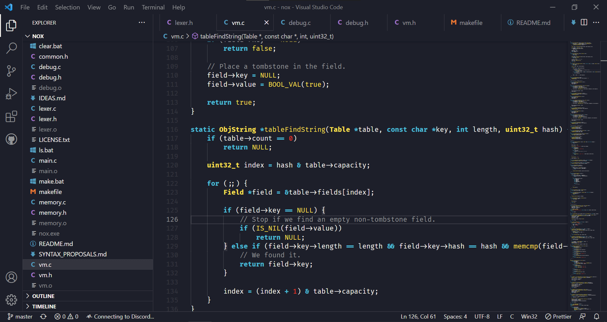

# Illuminary

Illuminary is a vibrant dark-yellowish theme for vscode based on the Pantone colors of the year 2021.

## License

It is distributed under the [MIT license][], a short and simple permissive license with conditions _only_ requiring **preservation of copyright and license notices**. Licensed works, modifications, and larger works may be distributed under different terms and without source code.

[mit license]: https://raw.githubusercontent.com/Aerobird98/illuminary/master/LICENSE.txt
